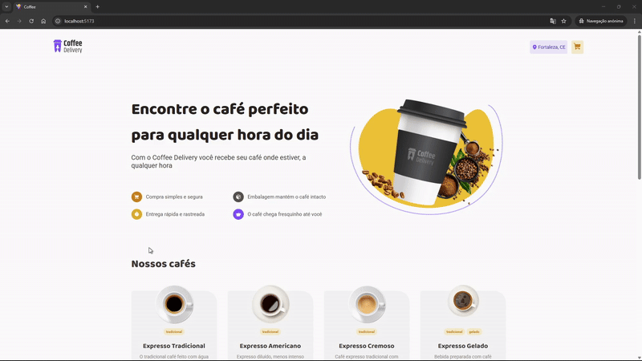
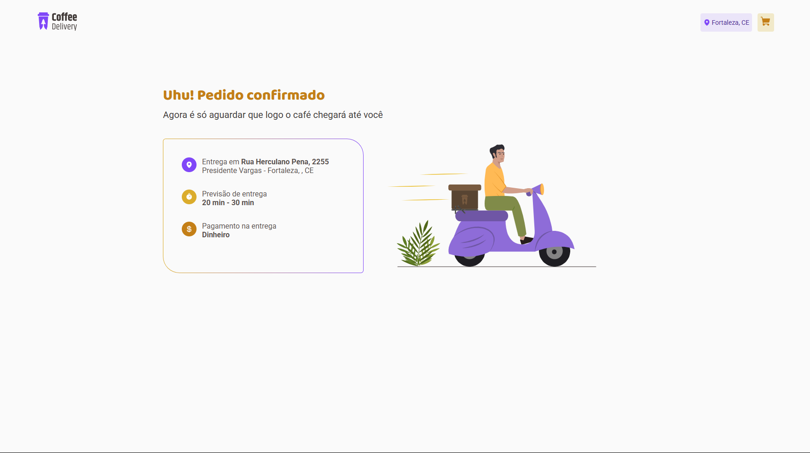

<h1 align="center" style="font-weight: bold;"> Coffe Delivery 💻</h1>

<p align="center">
 <a href="#tech">Tecnologias</a> • 
 <a href="#started">Iniciando projeto</a> • 
  <a href="#colab">Colaborador</a> •
</p>

<p align="center">
    <b>Entregando o seu café onde estiver.</b>
</p>

<p align="center">
     <a href="https://github.com/PauloVitorrr/coffe-delivery">📱 Visit this Project</a>
</p>

<h2 id="layout">🎨 Layout</h2>

<p align="center">
    
    
</p>

<h2 id="technologies">💻 Technologies</h2>

- React
- Styled components
- React hook form
- Zod
- playwright

<h2 id="started">🚀 Iniciando o projeto</h2>

<h3>Pre requisitos</h3>

Aqui está todos os requisitos que voce precisa para rodar o projeto:

- [NodeJS](https://nodejs.org/en/download)
- [Git](https://git-scm.com/downloads)

<h3>Clone</h3>

Como clonar o repositorio

```bash
git clone https://github.com/PauloVitorrr/coffee-delivery.git
```

<h3>Iniciando</h3>

Como iniciar o projeto

```bash
cd coffee-delivery
npm install
```

<h2 id="colab">🤝 Collaborators</h2>

Colaborador único do projeto

<table>
  <tr>
    <td align="center">
      <a href="#">
        <br>
        <sub>
          <b>Paulo Vitor</b>
        </sub>
      </a>
    </td>
  </tr>
</table>
